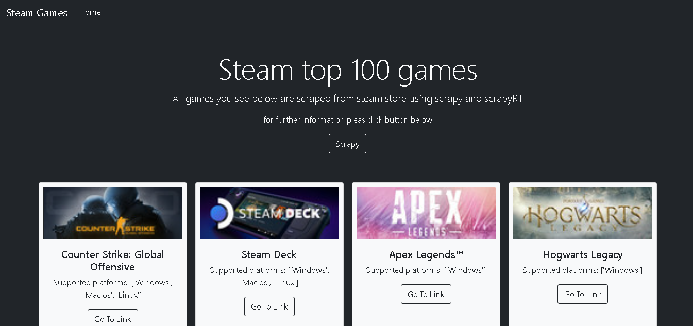

## How to run locally
- for scraping open steam/spiders folder and use this command "scrapy crawl best_listing.py" to run spider or 
- for run ScrapyRT just run "scrapyrt on terminal CLI, open browser with http://127.0.0.1:9080/ to start scrape   using scrapyRT the write http://127.0.0.1:9080/crawl.json?start_requests=true&spider_name=best_selling"

## Run on flask
- run scrapyRT then Run the flask it will automate scrape the website

## Requirement
- scrapy
- flash
- scrapyRT

## preview scrape
using Bootsrap to beutify the website

